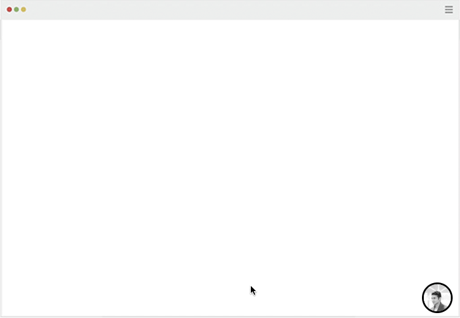
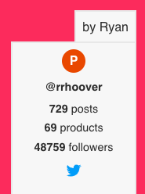
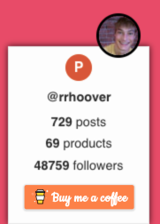

---
# Feel free to add content and custom Front Matter to this file.
# To modify the layout, see https://jekyllrb.com/docs/themes/#overriding-theme-defaults
title: MakerBadge
layout: landing
footer: A collaboration by <a href="http://twitter.com/chriskonings" target="_blank">@chriskonings</a> & <a href="http://twitter.com/graeme_fulton" target="_blank">@graeme_fulton</a>
---

<h1 class="landing-header u-text-center"><span class="landing-header__text">MakerBadge</span></h1>

<h4 class="u-text-center">An open-source badge to put your mark on every project.</h4>



<!-- <svg class="landing-icon" width="160" height="94" xmlns="http://www.w3.org/2000/svg"><g fill="none" fill-rule="evenodd" stroke-width="4"><rect stroke="#CDCDCD" x="2" y="29" width="156" height="63" rx="8"/><circle stroke="#000" fill="#000" fill-rule="nonzero" opacity=".1" cx="57.5" cy="45.5" r="33.5"/><circle stroke="#1D1D1D" fill="#FFF" fill-rule="nonzero" cx="57.5" cy="35.5" r="33.5"/></g></svg> -->


<h1 class="u-text-center" style="margin-top:6rem">1. Get your badge:</h1>

<p class="u-text-center"></p>

```html
<!-- Insert makerbadge.js (download or use ☁️cloud version) -->

<script src="//makerbadge.s3.amazonaws.com/makerbadge.js">
</script>

<!-- Initialise MakerBadge with options -->
    
<script>
  MakerBadge.init({id: 'USERIDHERE'}); // Product Hunt ID 
</script>
```

<p class="u-text-center">
  Your Product Hunt ID can be foud on your PH profile page (e.g. #309280). 
</p>

<div style="    text-align: center;
    margin: 3rem auto 8rem;
    display: block;">
<a class="btn" href="js/makerbadge.js" download>Download MakerBadge.js</a>
</div>

<h1 class="u-text-center" style="margin-top:6rem">2. Customise your badge (Beta):</h1>

<div class="u-text-center" style="margin:3rem 0 0">
  
  
  
</div>
<p class="u-text-center"  style="margin:2rem 0 2rem">
  Choose from 3 themes, and customise layout:
</p>

```html
    <script>
       MakerBadge.init({
        id: 'USERIDHERE', // Product Hunt ID
        theme: 3, // 3 Themes: 1, 2 or 3
        name: 'CUSTOMNAME', // Use any name you want
        twitter: '@yourusername' // Link to twitter
        position: 'left', // left or right
        customHTML: '<div>' //custom embeds e.g. buy me a coffee
      });
    </script>
```

<h1 class="u-text-center" style="margin:6rem 0 3rem 0">Contribute</h1>

<div class="u-text-center">
  
</div>

<h3 class="u-text-center">Proudly an open source project</h3>

<p class="u-text-center">
  Feel free to contribute
  <a target="_blank" href="https://github.com/chriskonings/maker-badge">here</a>
</p>
